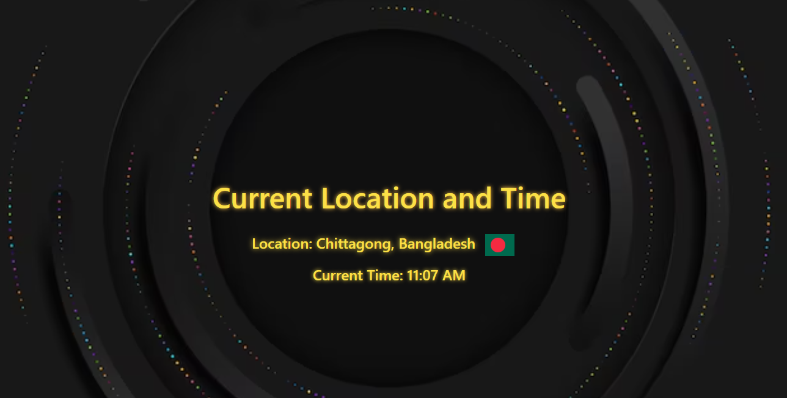
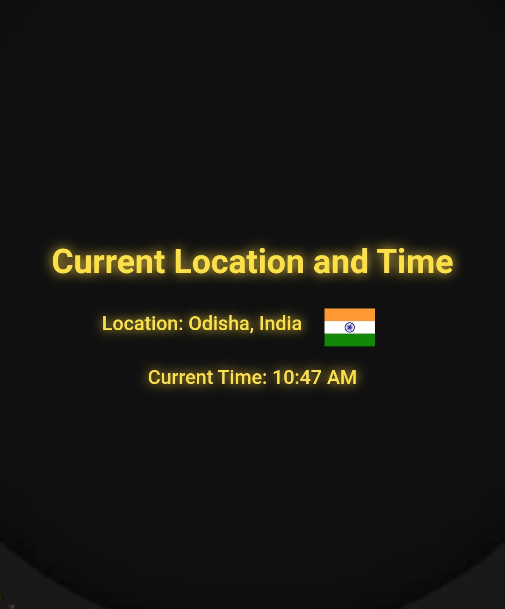
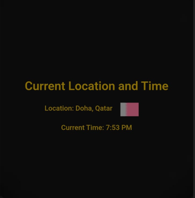

# CCC-"Country-CountryFlag-Clock" 
## By going through this link, visitors can see their current location, time, and their country flag. Please enable your location if it asks to enable it, if it won't, then do it manually. Wanna try?

# https://client-ccc.vercel.app/

## Here are some outputs...

